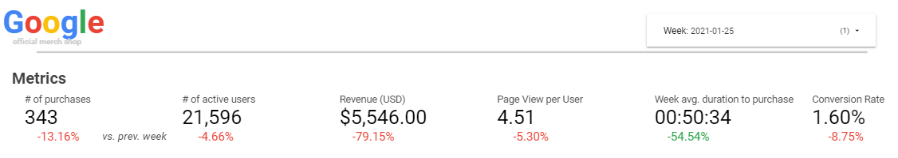
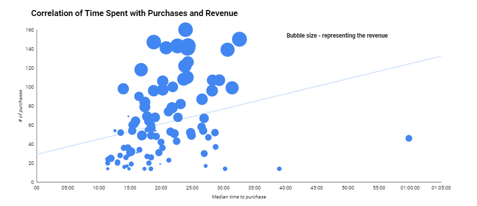
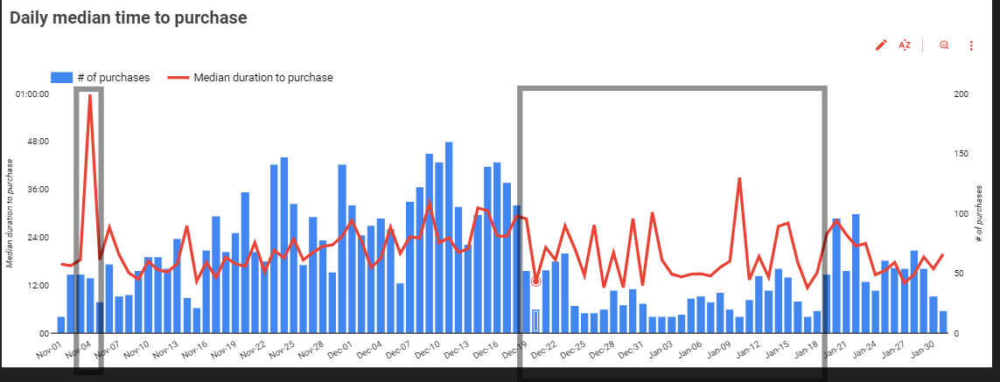
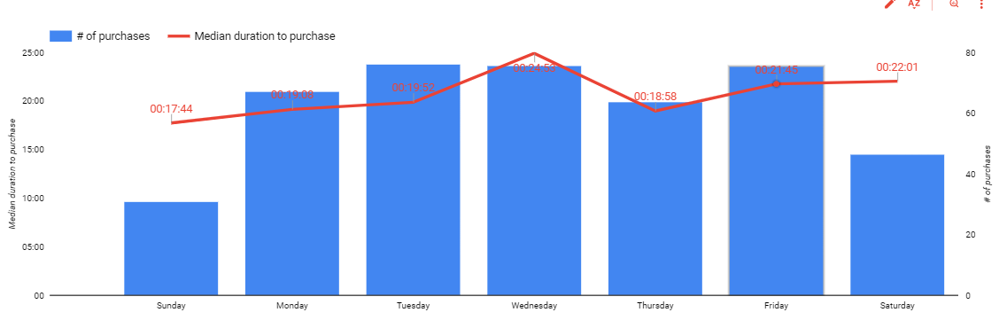
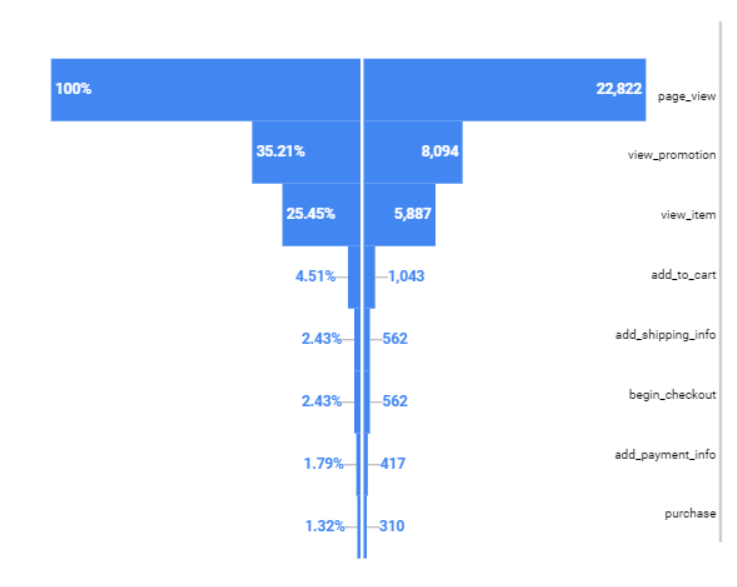
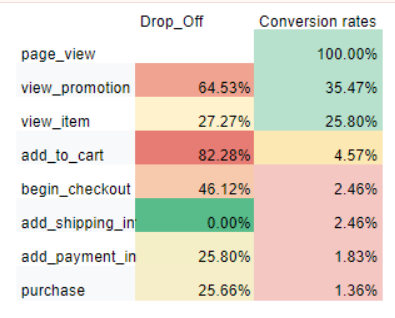

# Web Analytics: Customer Purchase Behavior Analysis

## Overview

This project aims to provide an analysis of customer behavior on the Google Merch Shop. The primary objectives include:

* Building a real-time dashboard to compare web events from the current week to the previous week.
* Measuring the time it takes for users to complete a purchase on the same day after first visiting the website.
* Make a funnel analysis to identify bottlenecks in the user journey;
* Conducting A/B tests:
  1. Comparing Newsletter conversion rates between two versions (NewYear_V1 vs. NewYear_V2).
  2. Analyzing if there's a significant difference in purchase times between Apple users using Chrome 86.0 vs. 87.0.

This analysis simulates real-world scenarios where businesses aim to improve user experience, optimize marketing efforts, and understand customer purchasing behavior. We assume that data accuracy is high, and web events are consistently captured for the analysis.

### Content

* [Dashboard](https://lookerstudio.google.com/reporting/9891ff1a-e587-4f39-9f52-c33d6dddaf34) created in Looker studio;
* Access A/B testing and results in [Google Sheets](https://docs.google.com/spreadsheets/d/1_F4wYRVG4dKs78_qINT_D3dUsjx9L1w-traR3Kjc4KI/edit?usp=sharing);
* `data/` folder contains data analysed;
* `AB testing queries/` and `Data viz queries/` contains queries;
* `PDF reports ` contains dashboard report in PDF to preview.

## Problems

1. Session duration problems possibly due to latency problems in website. 
2. Newsletter Conversion Effectiveness: stakeholders want to understand which version of NewYear campaign newsletter improves conversions.

### Analysis Process

* **BigQuery** was used to extract session duration, calculating purchase time, validating data.
* **IBM SPSS, Sheets add-on** was used to conduct statistical testing for an A/B testing newsletter, browser impact on purchase time (t-test, Pearson Chi-square test).
* **Looker** was used for data visualization to communicate trends, patterns.

### Data Source
BigQuery sample dataset for Google Analytics ecommerce web implementation was used, [`ga4_obfuscated_sample_ecommerce dataset`](https://console.cloud.google.com/bigquery?p=bigquery-public-data&d=ga4_obfuscated_sample_ecommerce&t=events_20210131&page=table). Full dataset can be found in Bigquery Public dataset link provided. 
For the analysis full dataset from 2020-11-01 to 2021-01-31 was used to analyse full raw dataset. `raw_events` table schema and preview can be found in `data/` folder.

### Data Processing
SQL queries used for the analysis can be found in `AB testing queries/` folder and `Data viz queries/`.

## Findings 

1. The New Year newsletter attracted some users through the NewYear_V1 and NewYear_V2 campaigns, which ran from January 27, 2021, to January 31, 2021. However, no significant increase in metrics was observed. Sales volume decreased by 13.16%, and the number of active users dropped by 4.66% compared to the previous week. On average, users were less engaged, with 4.51 page views per user, which is a 5.30% decrease from the week of January 18, 2021. An A/B test was conducted to compare the newsletters’ conversion rates from page views to item views, but the results were statistically insignificant due to a sample ratio mismatch.
   (See Figure 1)

*Figure 1: Screenshot from my real-time dashboard showing the metrics for week of 2021-01-25 to 2021-01-31.*

2. A noticeable correlation was observed between the median time to purchase and the number of purchases, suggesting that users who spend more time on the site are more likely to complete a purchase. (See Figure 2)
 
*Figure 2: Screenshot from my real-time dashboard showing scatter plot with linear line.*

3. The average time for a customer to decide to purchase, from entering the website to completing the purchase, is 20 min. 35 sec. From around December 20, 2020, this duration dropped together with # of purchases. 
On the day of 2020-11-04, the average purchase time was 112 minutes, while the median was 59 minutes, indicating the presence of outliers. This suggests that while most users completed their purchases in a reasonable timeframe, a small number took significantly longer, skewing the average. This spike also might be worth investigating.
   (See Figure 3)

*Figure 3: Screenshot from my real-time dashboard showing daily time to purchase and # of purchases.*

4. Notably, both average purchases and time spent are lower on weekends compared to weekdays, indicating a potential drop in user engagement. This trend suggests that marketing strategies may need to adapt to account for lower weekend activity and explore ways to enhance user engagement during these periods. Also take this into account when running an AB test.

*Figure 4: Screenshot from my real-time dashboard showing # of purchases and time to purchase duration from day of week perspective.*

5. From the funnel for the week of 2021-01-25, there is a clear bottleneck at the "Add to Cart" stage. 82% of users drop off after viewing an item without adding it to their cart. Additionally, a 46% cart abandonment rate from last week. This indicates that customers face barriers at the final stages of the purchase process and are abandoning their carts. To address this, the business could consider sending reminder emails to encourage customers to complete their purchases.

 

*Figure 5: Screenshot from my real-time dashboard showing funnel and drop off rates (excel calculation).*

6. Newsletter subscribers exposed to two different newsletters. While the analysis indicates a sample ratio mismatch, the results cannot be fully interpreted and further tests cannot be conducted reliably. To ensure valid conclusions, it is recommended to repeat the test with data collected to achieve a 50/50 sample ratio.

7. There is no statistically significant difference between Apple users average purchase duration using Chrome between version 87.0 and 86.0											
											

# Conclusions

* The average time for a customer to decide to purchase, from entering the website to completing the purchase, is 20 min. 35 sec.
* The funnel analysis reveals a significant drop-off at the "Add to Cart" stage and "Begin Checkout", highlighting a area for improvement as it doesn't reach industry benchmarks.
* AB test revealed that there is no statistically significant difference for time to purchase between 87.0 and 86.0 Chrome browser version users, meaning no latency problems. 
* Due to sample ratio mismatch no conclusions can be drawn from Newsletter comparision. Repeat the test reaching more customers. 

# Recommendations

* **Cart Abandonment**: Focus on reducing cart abandonment with retargeting campaigns and simplifying the checkout process.
* **Holiday Promotions:** Optimize campaigns before holidays, as user engagement typically drops during major holidays. Pre-holiday marketing efforts could be the key driver of conversions.
* **Optimize Mid-Week Marketing**: Enhance mid-week promotions on Wednesdays and Thursdays to maximize user acquisition and engagement.
* **Customer Retention:** Try loyalty programs and targeted post-purchase engagement to encourage repeat purchases from existing customers. (Chart returning vs new customers).

## Limitations

* Purchase duration is calculated within the same day: if user entered page i.e. before midnight 23:50 EET and finished purchase on next day 00:05 EET, average time to purchase for that customer is 5 minutes.
* Calculation focuses on only one purchase per customer per day.
* Purchases that was made via referral mostly 0.00 $, however still included as purchase impacting total # of purchases.
* To reduce impact of long sessions when customers left session running, **median was used for duration to purchase**.
